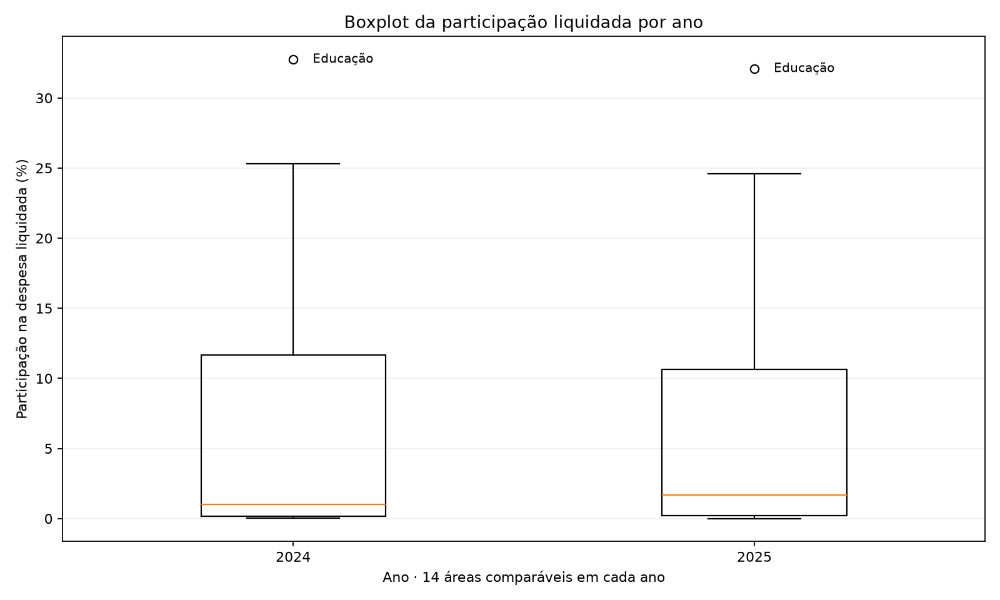
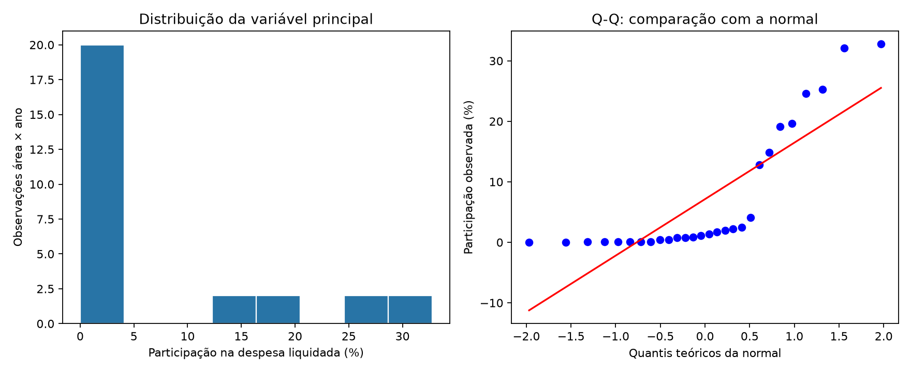
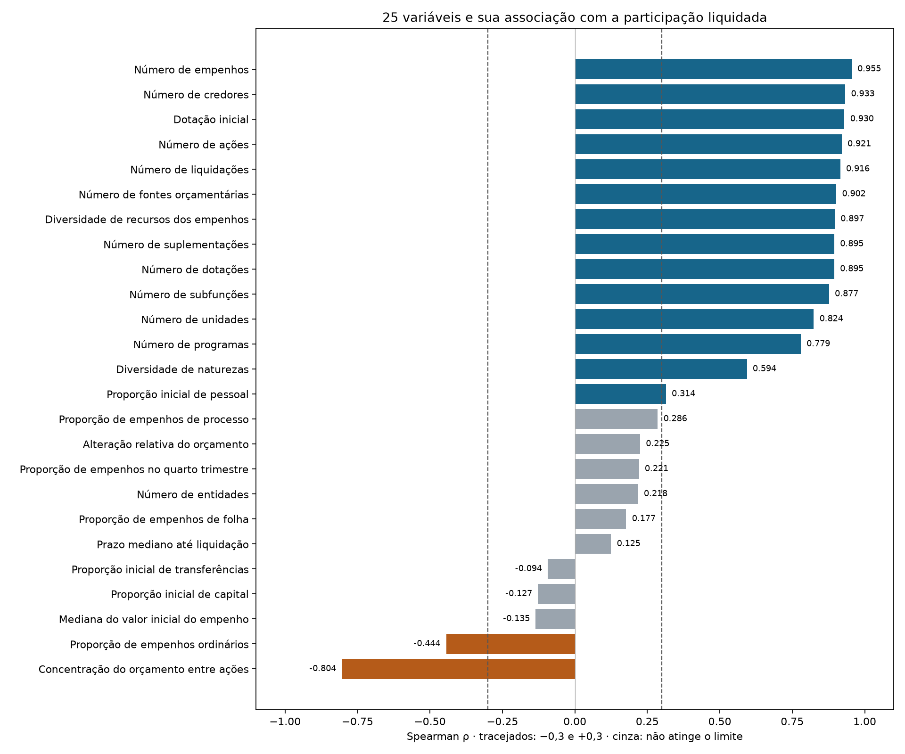
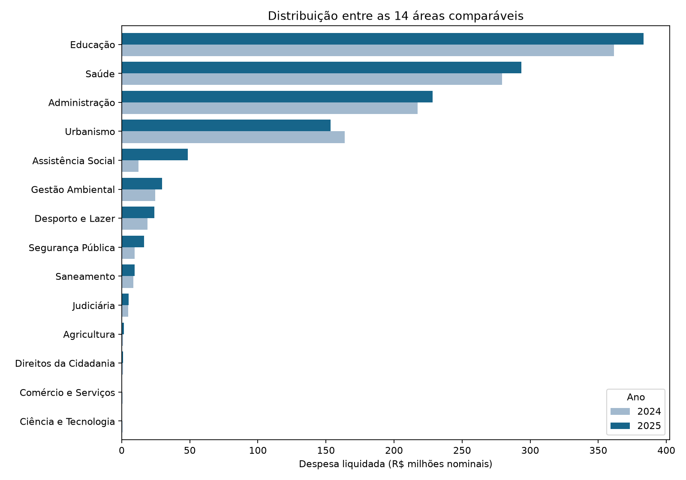

# Distribuição dos recursos da Prefeitura de Criciúma

**Projeto de aprendizagem estatística · 2024 e 2025**

Leia este roteiro de cima para baixo. Depois acompanhe as mesmas etapas comentadas em `analise.py`. O banco compacto já está incluído; não é necessário conhecer a preparação de milhares de anexos para começar a estudar.

## 1. Traçar a pergunta

> Como os recursos da Prefeitura de Criciúma foram distribuídos entre as áreas em 2024 e 2025, e como a análise estatística pode ajudar a planejar melhor essa distribuição?

“Área” significa função orçamentária, como Educação, Saúde e Urbanismo. Não é sinônimo de secretaria. O recorte inclui as entidades do Executivo que constam nos arquivos fornecidos.

## 2. Escolher a variável principal

A variável resposta, ou alvo **Y**, é `participacao_liquidada`:

**valor liquidado da área ÷ valor liquidado de todas as áreas comparáveis no mesmo ano.**

Uma participação de 0,20 significa 20%. O denominador é o conjunto comparável usado no estudo, não uma estimativa de todo o orçamento municipal. Valores absolutos também são apresentados para não confundir perda de participação com redução do gasto em reais.

A unidade de observação é **área × ano**. São 14 áreas nos dois anos, portanto 28 observações. As mesmas áreas se repetem: isso limita a interpretação inferencial dos testes.

## 3. Escolher as variáveis explicativas

As 25 variáveis **X** são candidatas a se relacionar com Y. Não são outros 25 alvos. O arquivo `variaveis.csv` contém a descrição, a fórmula e a origem de cada uma.

- **Planejamento e estrutura:** dotação inicial; número de dotações, programas, ações, unidades, subfunções, entidades e naturezas; concentração do orçamento entre ações.
- **Composição orçamentária:** proporções iniciais de pessoal, capital e transferências; número de fontes e suplementações; alteração relativa do orçamento.
- **Execução e organização:** número de empenhos, credores, recursos e liquidações; mediana do valor do empenho; proporções de empenhos de folha, de processo e ordinários; prazo mediano de liquidação; proporção de empenhos no último trimestre.

A lista foi mantida inteira. Uma variável não foi retirada por apresentar correlação baixa. Várias medidas refletem o tamanho da área e se relacionam entre si: não são 25 dimensões independentes.

## 4. Selecionar e juntar as bases

Apenas quatro arquivos centrais são necessários:

| Base | Ano | Papel |
|---|---:|---|
| Despesas por Programas e Ações | 2024 | Orçamento e resposta financeira por área |
| Despesas por Programas e Ações | 2025 | Orçamento e resposta financeira por área |
| Execução Detalhada de Despesas | 2024 | Características da execução |
| Execução Detalhada de Despesas | 2025 | Características da execução |

Os únicos anexos necessários são **fontesRecursos, suplementacoes, dotacaoOrcamentaria, credor e liquidacoes**. Os nomes exatos dos quatro arquivos e seus hashes estão em `dados/fontes.csv`.

Não entram neste roteiro os arquivos de cargos, servidores, dispensas, contratos ou dados de 2026. Não somamos a base de pessoal à execução, pois isso pode contar a mesma despesa duas vezes. O valor monetário da resposta vem apenas de `valorLiquidadoAtualizado` da base de programas e ações. Empenho, liquidação e pagamento não são somados entre si.

### Banco compacto

`dados/banco.sqlite` contém oito tabelas relacionadas:

| Tabela | Uma linha representa |
|---|---|
| `areas` | Uma função orçamentária |
| `entidades` | Uma entidade pública |
| `recursos` | Uma combinação de descrição, tipo e finalidade de recurso |
| `credores` | Um identificador de credor, sem divulgar seu documento |
| `dotacoes` | Uma dotação identificada por entidade, ano e número |
| `fontes_dotacao` | Um vínculo entre dotação e recurso |
| `empenhos` | Um empenho identificado por entidade, ano e número |
| `liquidacoes` | Uma liquidação identificada por empenho e número |

As relações são verificadas com chaves estrangeiras. Dotações, empenhos e liquidações têm unidades diferentes: primeiro resumimos cada uma por área e ano, depois juntamos as características. Não fazemos uma soma financeira depois de multiplicar linhas em uma junção de um para muitos.

Normalização relacional e normalidade estatística são conceitos diferentes. Organizar tabelas e chaves não transforma as distribuições dos números.

### Limpeza mínima e explícita

1. Remover espaços nas extremidades dos textos e converter valores e datas.
2. Conciliar repetições pela chave. Valores concordantes são mantidos uma vez; conflitantes ficam ausentes.
3. Conservar os valores mínimo e máximo das versões de liquidação das dotações para descrever o conflito, sem escolher arbitrariamente uma versão.
4. Usar somente áreas presentes nos dois anos e com resposta financeira sem conflito no painel de correlações.

Cultura tem divergências em quatro dotações de 2025. Habitação não aparece como função em 2024. As duas continuam na tabela geral, mas ficam fora do painel comparável. Ausência de registro não é prova de gasto zero. As ocorrências relevantes estão em `dados/qualidade.csv`; os originais continuam sendo a referência para consultar todas as versões.

As transformações são contagens, somas, proporções, mediana, diferença de datas e uma soma de quadrados para concentração. **Não há logaritmos, padronização z-score, imputação pela média, exclusão por valor alto ou transformação para forçar uma correlação.**

## 5. Descrever antes de testar

Observe quantidade de dados, média, mediana, desvio padrão, quartis, mínimo, máximo e assimetria em `resultados/descritiva.csv`. Compare a média e a mediana e examine o histograma da variável resposta.

### Boxplot e identificação de outliers

O boxplot compara as participações das 14 áreas dentro de cada ano. A caixa vai de Q1 a Q3, a linha interna marca a mediana e os pontos externos aos bigodes indicam valores além dos limites de Tukey: Q1 − 1,5 × IQR e Q3 + 1,5 × IQR. Os quartis usam interpolação linear, padrão do pandas. Os bigodes chegam aos valores extremos ainda dentro dessas cercas.

Os limites são calculados por ano. `resultados/limites_outliers.csv` mostra Q1, Q3, IQR e os limites; `resultados/outliers.csv` identifica ano, área e valor. Educação foi marcada como outlier superior em 2024 e 2025. São duas observações da mesma área. Nenhuma foi removida dos testes. Áreas têm escalas e necessidades diferentes, portanto esse destaque não comprova gasto excessivo ou irregularidade.



## 6. Verificar a normalidade com Shapiro–Wilk

O teste é aplicado separadamente a **Y e às 25 variáveis X**. Não se testa “o banco inteiro” como se ele tivesse uma única distribuição.

- **H0:** a distribuição é normal.
- **H1:** a distribuição não é normal.
- **Alfa:** 0,05.
- **p < 0,05:** rejeitar H0.
- **p ≥ 0,05:** não rejeitar H0; isso não prova normalidade.

Veja W, p e a interpretação em `resultados/shapiro_wilk.csv`. O histograma e o gráfico Q-Q estão em `resultados/normalidade.png`. No Q-Q, afastamentos da linha ajudam a visualizar o desacordo com a distribuição normal.

Contagens são discretas e participações têm limites. Além disso, uma área aparece em dois anos. Assim, os valores-p servem como diagnóstico exploratório, não como comprovação de pressupostos de independência. Não fazemos 26 decisões confirmatórias independentes a partir desses testes.



## 7. Analisar as correlações

O coeficiente principal é **Spearman**, que descreve associação monotônica por ordenação. Também mostramos **Pearson**, que descreve associação linear. O Shapiro–Wilk auxilia a interpretação; sozinho, não obriga a usar Spearman nem torna Pearson inválido.

O critério solicitado é estrito: **ρ < −0,3 ou ρ > +0,3**. A tabela mantém as 25 variáveis, incluindo aquelas que não atingem esse limite. Não escolhemos o melhor coeficiente para cada variável para completar a meta.

A mesma tabela inclui Spearman em cada ano e uma sensibilidade simples: retirar uma área com seus dois registros e recalcular. Essa verificação ajuda a identificar dependência de uma única área. Correlação não demonstra causalidade, eficiência ou necessidade de financiamento.

### Quais variáveis atingiram o limite?

Foram **16 variáveis em Spearman**, não apenas 15. A [lista destacada](resultados/correlacoes_destaque.csv) mostra os nomes, coeficientes e a estabilidade ao retirar uma área. A [conclusão](resultados/CONCLUSAO.md) contém a mesma lista em tabela legível. Quinze relações permanecem além do limite em todas as retiradas avaliadas; a proporção inicial de pessoal é a relação mais sensível entre as 16 selecionadas pelo critério.

O gráfico abaixo apresenta todas as 25, inclusive as nove que não atingiram o limite. Tracejados marcam −0,3 e +0,3; azul indica associação positiva além do limite, laranja indica negativa e cinza indica que o limite não foi atingido.



## 8. Responder à pergunta e apoiar o planejamento

Consulte `resultados/CONCLUSAO.md`. Use o gráfico de distribuição e a tabela de todas as áreas para explicar os montantes e as mudanças entre anos. Para sugerir uma distribuição melhor, relacione esses achados a demanda, atendimento e metas; tais indicadores ainda não estão incluídos neste estudo.

Os valores são nominais, sem correção pela inflação. Há diferenças entre os retratos das duas fontes e não foi realizada conciliação final com o balanço oficial. O estudo não deve ser apresentado como fechamento contábil auditado de todo o Município.



## Executar

Requer Python 3.10 ou mais recente. No terminal, dentro desta pasta:

```powershell
python -m pip install -r requirements.txt
python main.py
```

São apenas três bibliotecas externas: **pandas**, **scipy** e **matplotlib**. SQLite, leitura de arquivos e controle dos caminhos pertencem à biblioteca padrão do Python.

Para reconstruir também o banco diretamente dos originais:

```powershell
python main.py --reconstruir "..\dados prefeitura"
```

A reconstrução lê muitos arquivos e demora mais. A execução comum usa o banco incluído, funciona sem a pasta antiga de análise e não precisa de conexão com a internet depois de instalar as bibliotecas. Ela atualiza apenas os resultados desta pasta. A opção `--reconstruir` também substitui o banco compacto depois das verificações; não modifica os originais.

## Estrutura final

```text
projeto_final/
├── README.md                roteiro de aprendizagem
├── main.py                  ponto de entrada
├── preparar_dados.py        leitura e conciliação dos originais
├── analise.py               etapas estatísticas comentadas
├── requirements.txt         pandas, scipy e matplotlib
├── variaveis.csv            dicionário das 25 variáveis
├── dados/
│   ├── banco.sqlite         oito tabelas relacionadas
│   ├── fontes.csv           origem e identificação dos quatro CSVs centrais
│   └── qualidade.csv        conflitos e vínculo ausente
└── resultados/
    ├── base_analitica.csv
    ├── distribuicao_areas.csv
    ├── descritiva.csv
    ├── shapiro_wilk.csv
    ├── correlacoes.csv
    ├── correlacoes_destaque.csv
    ├── correlacoes.png
    ├── limites_outliers.csv
    ├── outliers.csv
    ├── boxplot.png
    ├── normalidade.png
    ├── distribuicao.png
    └── CONCLUSAO.md
```

Os dados e resultados anteriores foram preservados fora desta pasta. Eles não são necessários para executar a versão final.

## Verificação desta entrega

A reconstrução foi executada diretamente dos arquivos originais. A execução comum também foi testada. As 25 variáveis e os coeficientes coincidiram com a análise anterior, e os arquivos originais permaneceram inalterados.

Resultado reproduzido: **16 variáveis com |ρ| > 0,3 em Spearman e 14 com |r| > 0,3 em Pearson**. Para Y, Shapiro–Wilk: **W = 0,692839 e p = 0,00000226072**, rejeitando normalidade a 5% no diagnóstico exploratório. O banco tem oito tabelas, com integridade e chaves estrangeiras verificadas. A pasta final ocupa aproximadamente 5,3 MB, sem dependências instaladas.
